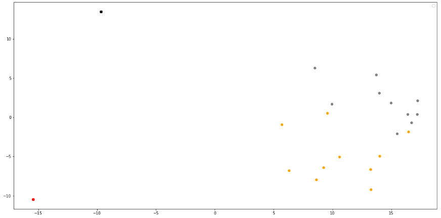
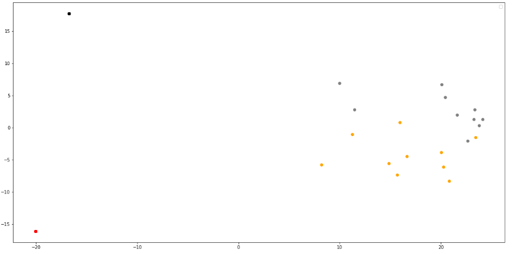

# Исследование получения эмбедингов

## Вывод 100 пар гиперонимов

## Кластеризация множества примеров 2 гиперонимов

### Оранжевые и серые точки - примеры употребелния гиперонимов  
### Чёрные и красные точки - гиперонимы  
### В данном случае исследуется слово мышь  
### Используется модель sberbank-ai/sbert_large_mt_nlu_ru  

Вектора представляются конкатенацией с последних 2 слоёв    

Вектора представляются конкатенацией с последних 3 слоёв

Вектора представляются конкатенацией с последних 4 слоёв

Вектора представляются суммой с последних 4 слоёв

исследование обучения модели: https://github.com/Y3g9r/HyperonymClassifier/blob/main/bert_4_layers_sum_research.md

