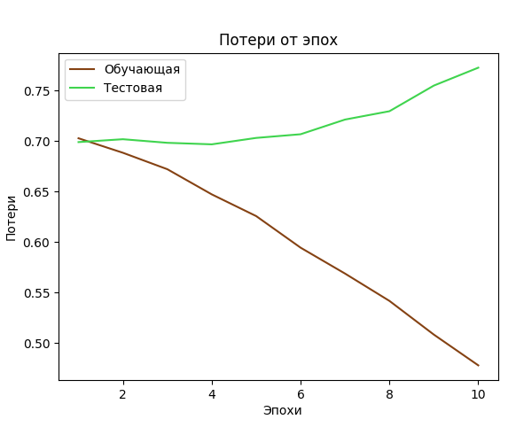
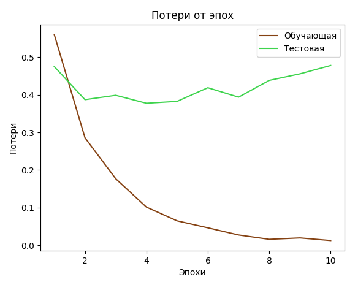

# Исследование обучения модели, в которой эмбединги представляются суммой с последних 4 слоёв

## Эксперимент 1

learning-rate: 0.0001

Число эпох: 24

Размер данных: 9600  
Размер батча: 4  

Fine-tuning:  
self.example_linear_1 = torch.nn.Linear(1024, 1024)  
self.example_linear_2 = torch.nn.Linear(1024, 1024)  

self.def_linear_1 = torch.nn.Linear(1024, 1024)  
self.def_linear_2 = torch.nn.Linear(1024, 1024)  

self.Linear = torch.nn.Linear(1024, 1)  
self.tanh = torch.nn.Tanh()  
self.sigm = torch.nn.Sigmoid()  

Время обучения: ~24 часа  

## Эксперимент 2

learning-rate: 0.0001  

Число эпох: 24  

Размер данных: 9600  
Размер батча: 4  

Fine-tuning:  
self.example_linear_1 = torch.nn.Linear(1024, 32)  
self.example_linear_2 = torch.nn.Linear(32, 1)  

self.def_linear_1 = torch.nn.Linear(1024, 32)  
self.def_linear_2 = torch.nn.Linear(32, 1)  

self.Linear = torch.nn.Linear(1, 1)  
self.tanh = torch.nn.Tanh()  
self.sigm = torch.nn.Sigmoid()

Время обучения: ~24 часа  

## Эксперимент 3

learning-rate: 0.0001  

Число эпох: 10  

Размер данных: 4800  
Размер батча: 4  

Fine-tuning:  
self.example_linear_1 = torch.nn.Linear(1024, 128)  
self.example_linear_2 = torch.nn.Linear(128, 32)  

self.def_linear_1 = torch.nn.Linear(1024, 128)  
self.def_linear_2 = torch.nn.Linear(128, 32)  

self.Linear = torch.nn.Linear(32, 1)  
self.tanh = torch.nn.Tanh()  
self.sigm = torch.nn.Sigmoid()  

Время обучения: ~12 часов  

## Измениния в данных

*Определения и примеры под лейблом 1 остаются исходными*  
*примеры под лейблом 0 заменяются случайным образом на 1 из 10*
*заранее заданных с использованием определения из лейбла 1*  

*Пример:*  
*лейбл 1:*  
*Контекстный пример: мышь грызёт зёрна и остерегается кота*  
*Определение: мышь это грызун который вредит в хозяйстве*  
*лейбл 0:*  
*Контекстный пример: с горы мышь видно всю дорогу*  
*Определение: мышь это грызун который вредит в хозяйстве*  

## Эксперимент 1

### замена лейбла 0: 100 %

learning-rate: 0.0001  

Число эпох: 10  

Размер данных: 1200  
Размер батча: 4  

Fine-tuning:  
self.example_linear_1 = torch.nn.Linear(1024, 128)  
self.example_linear_2 = torch.nn.Linear(128, 32)  

self.def_linear_1 = torch.nn.Linear(1024, 128)  
self.def_linear_2 = torch.nn.Linear(128, 32)  

self.Linear = torch.nn.Linear(32, 1)  
self.tanh = torch.nn.Tanh()  
self.sigm = torch.nn.Sigmoid()  

Время обучения: ~30 минут  

## Эксперимент 2

### замена лейбла 0: 70 %
### 30% лейбла 0 не изменяются

learning-rate: 0.0001  

Число эпох: 10  

Размер данных: 1200  
Размер батча: 4  

Fine-tuning:  
self.example_linear_1 = torch.nn.Linear(1024, 128)  
self.example_linear_2 = torch.nn.Linear(128, 32)  

self.def_linear_1 = torch.nn.Linear(1024, 128)  
self.def_linear_2 = torch.nn.Linear(128, 32)  

self.Linear = torch.nn.Linear(32, 1)  
self.tanh = torch.nn.Tanh()  
self.sigm = torch.nn.Sigmoid()  

Время обучения: ~30 минут  

## Эксперимент 3

### замена лейбла 0: 70 %
### 30% лейбла 0 не изменяются

learning-rate: 0.00001  

Число эпох: 10  

Размер данных: 1200  
Размер батча: 4  

Fine-tuning:  
self.example_linear_1 = torch.nn.Linear(1024, 128)  
self.example_linear_2 = torch.nn.Linear(128, 32)  

self.def_linear_1 = torch.nn.Linear(1024, 128)  
self.def_linear_2 = torch.nn.Linear(128, 32)  

self.Linear = torch.nn.Linear(32, 1)  
self.tanh = torch.nn.Tanh()  
self.sigm = torch.nn.Sigmoid()  

Время обучения: ~30 минут  

## Эксперимент 4

### замена лейбла 0: 80 %
### 20% лейбла 0 не изменяются

learning-rate: 0.0001  

Число эпох: 10  

Размер данных: 1200  
Размер батча: 4  

Fine-tuning:  
self.example_linear_1 = torch.nn.Linear(1024, 128)  
self.example_linear_2 = torch.nn.Linear(128, 32)  

self.def_linear_1 = torch.nn.Linear(1024, 128)  
self.def_linear_2 = torch.nn.Linear(128, 32)  

self.Linear = torch.nn.Linear(32, 1)  
self.tanh = torch.nn.Tanh()  
self.sigm = torch.nn.Sigmoid()  

Время обучения: ~30 минут  

## Измениния в данных

*Определения и примеры под лейблом 1 остаются исходными*  
*примеры под лейблом 0 заменяются на примеры из лейбла 1*
*с противоположным индексом в массиве (с соответствующей заменой определения)*  

*Пример:*  
*лейбл 1:*  
*Контекстный пример: мышь грызёт зёрна и остерегается кота*  
*Определение: мышь это грызун который вредит в хозяйстве*  
*лейбл 0:*  
*Контекстный пример: с горы мышь видно всю дорогу*  
*Определение: мышь это грызун который вредит в хозяйстве*  

*лейбл 1:*  
*Контекстный пример: с горы Эльбрус видно всю дорогу*  
*Определение: самая высокая горная вершина России и Европы*  
*лейбл 0:*  
*Контекстный пример: Эльбрус грызёт зёрна и остерегается кота*  
*Определение: самая высокая горная вершина России и Европы*  

## Эксперимент 1

learning-rate: 0.0001  

Число эпох: 10  

Размер данных: 1200  
Размер батча: 4  

Fine-tuning:  
self.example_linear_1 = torch.nn.Linear(1024, 128)  
self.example_linear_2 = torch.nn.Linear(128, 32)  

self.def_linear_1 = torch.nn.Linear(1024, 128)  
self.def_linear_2 = torch.nn.Linear(128, 32)  

self.Linear = torch.nn.Linear(32, 1)  
self.tanh = torch.nn.Tanh()  
self.sigm = torch.nn.Sigmoid()  

Время обучения: ~30 минут  

## Эксперимент 2

learning-rate: 0.0001  

Число эпох: 10  

Размер данных: 1200  
Размер батча: 4  

Fine-tuning:  
self.example_linear_1 = torch.nn.Linear(1024, 512)  
self.example_linear_2 = torch.nn.Linear(512, 128)  

self.def_linear_1 = torch.nn.Linear(1024, 512)  
self.def_linear_2 = torch.nn.Linear(512, 128)  

self.Linear = torch.nn.Linear(128, 1)  
self.tanh = torch.nn.Tanh()  
self.sigm = torch.nn.Sigmoid()  

Время обучения: ~30 минут  

## Измениния в данных

*Эмбединги примеров и определений сводятся к 2-мерному пространству через PCA*  

*Вычисляется расстояние для лейбла 1 и лейбла 0 по отдельности*  

*Для лейбла 1 и 0 устанавливаются соответствующие границы, что позволяет*
*фильтровать выборку*  

## Эксперимент 1

Фильтрация по расстоянию:  

лейбл 1 < 75.0  

лейбл 0 > 75.0  

Fine-tuning:  
self.example_linear_1 = torch.nn.Linear(1024, 128)  
self.example_linear_2 = torch.nn.Linear(128, 32)  

self.def_linear_1 = torch.nn.Linear(1024, 128)  
self.def_linear_2 = torch.nn.Linear(128, 32)  

self.Linear = torch.nn.Linear(32, 1)  
self.cos = torch.nn.CosineSimilarity(1)  
self.tanh = torch.nn.Tanh()  
self.sigm = torch.nn.Sigmoid()  

## Эксперимент 2

Фильтрация по расстоянию:  

лейбл 1 < 70.0  

лейбл 0 > 80.0  

Fine-tuning:  
self.example_linear_1 = torch.nn.Linear(1024, 128)  
self.example_linear_2 = torch.nn.Linear(128, 32)  

self.def_linear_1 = torch.nn.Linear(1024, 128)  
self.def_linear_2 = torch.nn.Linear(128, 32)  

self.Linear = torch.nn.Linear(32, 1)  
self.cos = torch.nn.CosineSimilarity(1)  
self.tanh = torch.nn.Tanh()  
self.sigm = torch.nn.Sigmoid()  

## Эксперимент 3

Фильтрация по расстоянию:  

лейбл 1 < 75.0  

лейбл 0 > 80.0  

Fine-tuning:  
self.example_linear_1 = torch.nn.Linear(1024, 128)  
self.example_linear_2 = torch.nn.Linear(128, 32)  

self.def_linear_1 = torch.nn.Linear(1024, 128)  
self.def_linear_2 = torch.nn.Linear(128, 32)  

self.Linear = torch.nn.Linear(32, 1)  
self.cos = torch.nn.CosineSimilarity(1)  
self.tanh = torch.nn.Tanh()  
self.sigm = torch.nn.Sigmoid()  

